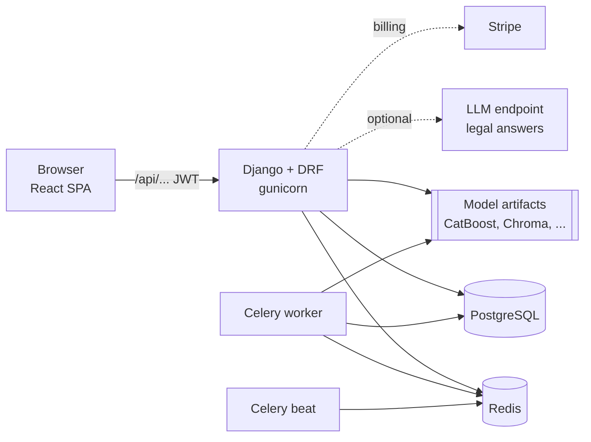

<div align="center">

# EstateMind

**Real-estate intelligence for Tunisia**: property valuation, price outlooks, investment scoring,
climate risk, a market simulator, a market chatbot and a Tunisian property-law assistant, in one
web platform.


</div>

---

## Contents

1. [What EstateMind does](#what-estatemind-does)
2. [How it works](#how-it-works)
3. [Repository layout](#repository-layout)
4. [Quick start with Docker](#quick-start-with-docker)
5. [Local development](#local-development)
6. [Configuration](#configuration)
7. [Data](#data)
8. [Machine learning](#machine-learning)
9. [Model artifacts](#model-artifacts)
10. [Testing and CI](#testing-and-ci)
11. [Deployment](#deployment)
12. [Limitations](#limitations)
13. [Principles](#principles)

---

## What EstateMind does

| Module | Page | What you get |
| --- | --- | --- |
| **Explore** | `/explore` | Map of real listings across 278 delegations, with a deal assessment per listing (below, around or above the local median price per m²), price and demand heat layers, a climate-risk layer and delegation KPIs |
| **Analyze** | `/analyze` | Market dashboard of reference price benchmarks for every delegation, and a 12-month **price outlook** with 90% ranges |
| **Valuate** | `/valuate` | An instant estimate for a property: price, range, the main price drivers (SHAP), comparable listings, confidence and where every figure comes from |
| **Invest** | `/invest/*` | Portfolio analysis (value, yield, forward IRR range, risk), a deal scanner, ranked opportunities and a risk view, all scored by **labelled, fixed rules** |
| **Simulate** | `/simulate` | An agent-based market simulator (buyers, sellers, developers, banks, speculators, government) with policy scenarios and adjustable rates, credit and demand |
| **Legal AI** | `/legal` | Answers on Tunisian property law, grounded in official texts with citations; it quotes the texts directly when no language model is reachable |
| **Chat** | every page | A market chatbot that answers from the database (prices, outlooks, rankings, climate) and never invents figures |
| **Community** | `/community` | The *#Aaref_Bledek* sign-up campaign |
| **Account** | `/account/*` | Profile, plans (Free, Pro, Investor) with Stripe subscriptions, settings |
| **Scraper admin** | `/admin/scraper` | Staff-only listing pipeline health and data-quality review |

Plans: **Free** covers the core pages. **Pro** ($50/month) unlocks the map's analytical layers and
price trends. **Investor** ($100/month) adds the saved investment portfolio. Payments use Stripe
subscriptions that renew monthly.

---

## How it works



- **API** (`apps/api`): one Django project with apps grouped by domain under `estatemind/`:

  | Group | Apps | Responsibility |
  | --- | --- | --- |
  | `platform` | users, billing, campaign | Accounts, JWT auth with e-mail OTP, Stripe, the campaign |
  | `market` | core, features, scraper | Regions, delegations, listings, market snapshots, map APIs, scraping pipeline |
  | `intelligence` | valuation, forecast, investor, climate, simulation | The models and scoring |
  | `assistants` | chatbot, legal | The market chatbot and the legal assistant |

  `config/paths.py` holds every filesystem location (data, artifacts, vector store), each
  overridable by an environment variable. Offline training code lives in `ml/`, apart from the
  serving code.
- **Background work**: Celery with Redis. Beat schedules calibration monitors, the valuation
  drift check, registry sync and daily summaries. Run exactly one beat process. Scraping outside
  sites is never scheduled (`ENABLE_AUTO_SCRAPER` stays off).
- **Web** (`apps/web`): React 18 (Create React App) with Tailwind, Leaflet (OpenStreetMap tiles)
  and Recharts. In production nginx serves it, and `config.js` written at container start tells
  it where the API is, so one build serves every environment.
- **API docs**: OpenAPI schema at `/api/schema/`, Swagger UI at `/api/docs/`.

---

## Repository layout

```
.
├── apps/
│   ├── api/                      Django 5.2 + DRF, Celery
│   │   ├── config/               settings, URLs, Celery app, paths
│   │   ├── estatemind/           platform / market / intelligence / assistants apps
│   │   ├── ml/                   offline training and evaluation scripts
│   │   ├── data/                 reference data (delegations, geography, climate normals,
│   │   │                         INS price index, coastline, simulator calibration, intents)
│   │   ├── scripts/artifacts.py  lock / verify / pack / fetch the model artifacts
│   │   ├── tests/                pytest suite
│   │   ├── artifacts/            trained models and vector store (gitignored)
│   │   └── artifacts.lock.json   what artifacts/ must contain (path, size, SHA-256)
│   └── web/                      React 18 + Tailwind, nginx image
├── docker-compose.yml            full local stack
└── .github/workflows/ci.yml      tests on SQLite and Postgres, web build, secret scan, images
```

---

## Quick start with Docker

Requirements: Docker with Compose, and the model artifacts (see [Model artifacts](#model-artifacts)).

```bash
git clone https://github.com/fares279/EstateMind.git
cd EstateMind

# 1. configuration: copy the template, then set SECRET_KEY and SIMPLE_JWT_SIGNING_KEY
cp apps/api/.env.example apps/api/.env

# 2. model artifacts (private repository: needs the GitHub CLI, logged in)
gh release download artifacts-20261002 -R fares279/EstateMind -D /tmp/em
mkdir -p apps/api/artifacts && tar -xzf /tmp/em/estatemind-artifacts-20261002.tar.gz -C apps/api/artifacts

# 3. run everything
docker compose up --build
```

| Service | URL |
| --- | --- |
| Web app | http://localhost:3000 |
| API | http://localhost:8000/api/ |
| API docs | http://localhost:8000/api/docs/ |

Compose starts Postgres, Redis, the API (which runs the migrations), a Celery worker, Celery beat
and the web app. Load the reference data once:

```bash
docker compose exec api python manage.py seed_demo_data
docker compose exec api python manage.py createsuperuser
```

`seed_demo_data` is idempotent. It loads the 24 governorates and 278 delegations, the real
listings, benchmark-based sample listings (marked `synthetic`, only where a delegation has no
real listing of a type), market snapshots, the price outlook and the climate scores.

---

## Local development

**API** (Python 3.12):

```bash
cd apps/api
python -m venv .venv
source .venv/bin/activate            # Windows: .venv\Scripts\activate
pip install -r requirements/dev.txt  # CPU build of PyTorch, from its own index
cp .env.example .env                 # set USE_SQLITE=True for a local database
python manage.py migrate             # again after every pull
python manage.py seed_demo_data
python manage.py runserver           # http://localhost:8000
```

**Web** (Node 24):

```bash
cd apps/web
npm ci
npm start                            # http://localhost:3000, calls http://localhost:8000/api
```

SQLite is for local work only. It does not enforce `max_length` and supports fewer query
features, which is why CI runs the suite on both SQLite and Postgres.

Useful management commands:

| Command | What it does |
| --- | --- |
| `seed_demo_data` | Load the reference data, listings, snapshots, outlook and climate scores |
| `generate_forecasts` | Rebuild the 12-month price outlook (rerun monthly, or after updating the INS index CSV) |
| `seed_climate_scores` | Recompute delegation climate scores |
| `calibrate_simulator` | Recalibrate the simulator's starting prices to the current listings |
| `index_legal_data` | Build a new legal vector collection; activated only if it passes the retrieval gate |
| `evaluate_legal_assistant` | Measure retrieval, routing and grounding on the evaluation set |
| `promote_model --version-id <id>` | Promote a registered valuation model |
| `retrain_intent_classifier` | Retrain the chatbot's intent classifier |
| `check_integrations` | Check that the e-mail, Stripe and LLM credentials work |

---

## Configuration

Every variable is listed with a placeholder in `apps/api/.env.example`. The real `.env` is
gitignored and must never be committed. The ones that matter:

| Variable | Notes |
| --- | --- |
| `SECRET_KEY`, `SIMPLE_JWT_SIGNING_KEY` | Required, long and random. The container refuses to start without a real `SECRET_KEY` |
| `DEBUG` | `False` outside development |
| `USE_SQLITE` | `True` for local work; otherwise `DB_NAME`, `DB_USER`, `DB_PASSWORD`, `DB_HOST`, `DB_PORT` (`DB_SSLMODE=require` for managed Postgres) |
| `REDIS_URL` | Celery broker and results |
| `CACHE_URL` | Redis in production, so rate limits and chat memory are shared by all workers |
| `ALLOWED_HOSTS`, `CORS_ALLOWED_ORIGINS`, `CSRF_TRUSTED_ORIGINS` | The real domains |
| `NUM_PROXIES` | Behind a load balancer, so rate limits count per client and not per proxy |
| `EMAIL_*`, `DEFAULT_FROM_EMAIL` | OTP and password-reset e-mail |
| `STRIPE_PUBLIC_KEY`, `STRIPE_SECRET_KEY`, `STRIPE_WEBHOOK_SECRET` | Billing needs all three |
| `STRIPE_PRICE_PRO`, `STRIPE_PRICE_INVESTOR` | Monthly Price ids. Set: renewing subscriptions. Blank: a payment gives 30 days |
| `LEGAL_LLM_*`, `LEGAL_LLM_FALLBACK_*` | Legal assistant language model (OpenAI-compatible or Claude) |
| `ESTATEMIND_ARTIFACTS_URL` | HTTPS bundle to fetch at start when artifacts are missing |
| `SIMULATION_BACKEND` | `celery` (on the worker, as in compose) or `thread` |
| `PRELOAD_LEGAL_EMBEDDING_MODEL` | `True` on web and worker for a fast first answer; `False` on beat |
| `VALUATION_CV_PRICE_ADJUSTMENT`, `VALUATION_SENTIMENT_PRICE_ADJUSTMENT` | Keep `False` (see [Valuation](#valuation)) |
| `ENABLE_AUTO_SCRAPER` | Keep `False` |

Web: `API_BASE_URL` at container start (`REACT_APP_API_URL` at build time is an optional
default), `REACT_APP_STRIPE_PUBLISHABLE_KEY`, and optionally `REACT_APP_MAP_TILE_URL`.

---

## Data

All reference data is in the repository, each file with its origin:

| File | Content | Origin |
| --- | --- | --- |
| `data/delegations.csv` | 278 delegations: population, benchmark price ranges and trends per type | Reference benchmarks (asking prices, undated) |
| `estatemind/intelligence/valuation/data/listings.csv` | 9,946 scraped listings | Tunisian listing sites; 109 rows whose "price" was a phone number were removed |
| `data/ins_property_price_index.csv` | Quarterly property price index 2000 Q1 to 2025 Q4: apartments, houses, land, all built | [Statistiques Tunisie (INS)](https://www.ins.tn/publication/indice-des-prix-de-limmobilier-quatrieme-trimestre-2025), from registered sales |
| `data/climate_governorate_normals.csv` | Rainfall, days above 35 °C, documented flood exposure, forest cover | Curated climate normals (approximate) |
| `data/tunisia_coastline.csv` | Simplified coastline, about 80 points | Hand-placed through coastal towns |
| `data/*_geography.csv` | Governorate and delegation centres | The original EstateMind database |
| `data/simulator_calibration.json` | Simulator starting-price multipliers and their error report | `calibrate_simulator` |
| `estatemind/assistants/legal/data/` | Legal corpus, evaluation questions, official texts with a manifest (URL, date, SHA-256, verification) | See [Legal assistant](#legal-assistant) |

Synthetic sample listings exist only where a delegation has no real listing of a type. They are
marked `source = "synthetic"` and are excluded from every model, median and deal assessment.

---

## Machine learning

Each component, and how far it has been checked against real data. "Measured" means on held-out
data or official statistics, not on the training data.

| Component | Method | Measured result |
| --- | --- | --- |
| Valuation | CatBoost per property type, served through a model registry (champion / challenger) | Median error 22.5% apartments, 31.2% houses, 35.5% land |
| Price outlook | INS national growth rate plus each delegation's benchmark deviation | 12-month growth error 5.6 / 5.7 / 3.7 points (apartments / houses / land), nationally |
| Deal assessment | Listing price per m² against the median of at least 5 comparable real listings | Rule (below 85%, 85–115%, above 115%) |
| Investor scoring | Fixed rules on price, rent, outlook and climate | Rules, labelled as such |
| Climate risk | Weighted composite of six factors from climate normals | Approximation, not a hazard map |
| Simulator | Mesa agent-based model, starting prices calibrated to listings | Starting-price error 16% apartments, 19% houses |
| Chatbot | Sentence-embedding intent classifier plus SQL-grounded answers and a number-grounding check | Intent accuracy 77% on 31 held-out questions |
| Legal assistant | Multilingual retrieval, NLI grounding gate, LLM or verbatim quotation | Retrieval recall@3 0.96; routing 43/43 held out |

### Valuation

- **Data**: `ml/shared/listings_dataset.py` turns `listings.csv` into a train/test split. The
  source has the governorate and town columns swapped in most rows (fixed per row, not by a
  blanket swap), generated-looking rows (dropped), and unreliable coordinates (not used).
- **Champions**: variant E serves apartments and land, and E2 (E without a redundant surface ×
  local-price feature) serves houses. On 833 held-out listings, scored through the serving code:

  | Median error | Previous champion | Served now |
  | --- | ---: | ---: |
  | Apartments (398) | 34.5% | 22.5% |
  | Houses (350) | 49.6% | 31.2% |
  | Land (85) | 59.2% | 35.5% |

- **Promotion**: a challenger must beat the champion on the same held-out set and pass an
  explanation-stability gate (its top SHAP features as a set). Train with
  `python -m ml.valuation.train_catboost_bundle --options e --register`, then `promote_model`.
- **Kept out of the price**: description sentiment raised prices 4–10% with no accuracy gain,
  and the photo signal is driven by pixel variance (a map scored +5%). Both are shown for
  information and are off in the price.

### Price outlook

A rolling-origin backtest on the official INS index (every quarter from 2005, 1–4 quarters
ahead) compared five ways to set next year's growth. The average growth since 2000 had the lowest
error for every type. The flat trend the benchmarks implied had the highest (7.1–9.0 points).
The outlook therefore grows each delegation's reference price at that national rate plus its
benchmark's deviation from the type's median trend. The 90% ranges come from the same backtest's
error quantiles. The index is national, so local accuracy is not measured.

### Simulator calibration

Starting prices come from real sale listing medians where a delegation has at least 5 listings of
a type. Elsewhere the benchmark is corrected by the median listing/benchmark ratio of its
governorate, but only where a leave-one-out check shows the correction helps. Error against
listings went from 34% to 16% for apartments and from 68% to 19% for houses. Land keeps its
benchmark, because the correction made it worse. The *buy now vs wait* backtest runs the model
itself and reports simulated outcomes, not forecasts.

### Legal assistant

- **Served corpus** (collection `legal_tunisia_all_v3`, 51 passages): registration duties,
  mortgage law, collective investment, debt recovery and the Ministry of Justice's
  land-registration guide.
- **Measured** on `data/eval_questions.json`: retrieval recall@3 0.96. The scope decision was
  checked held out (leave-one-out): 43/43. The grounding gate caught 10/10 unsupported claims and
  kept 10/12 supported ones.
- **Code des droits réels**: verified word by word against the official Journal (JORT) texts of
  its amending laws and stored with its provenance. It is **not served yet**: a collection that
  includes it failed the activation gate (recall@3 0.79 against a 0.85 target, and questions the
  corpus cannot answer were no longer blocked). Copies of the COC and the urban-planning code
  were rejected because they could not be verified.
- Without a reachable LLM, answers quote the most relevant sentences of the retrieved texts with
  citations, so they are grounded by construction.

### Rent

A rent-per-m² model trained on the 572 real rental listings beat the delegation medians on average
(26.7% vs 32.3% median error) but lost one of five test splits. Under the adoption rule set before
training (win every split), it is not used. Yields use the median rent of the delegation or
governorate. Retraining with `python -m ml.investor.train_rent_model` re-checks the rule.

---

## Model artifacts

Trained models and the legal vector store (56 files, about 150 MB) live in `apps/api/artifacts/`.
They are gitignored. `apps/api/artifacts.lock.json` records what must be there: each file's path,
size and SHA-256.

```bash
cd apps/api
python scripts/artifacts.py verify               # does the disk match the lock?
python scripts/artifacts.py lock                 # record the current files (after retraining)
python scripts/artifacts.py pack bundle.tar.gz   # bundle them
python scripts/artifacts.py fetch <https-url>    # download, verify against the lock, install
```

The current bundle is attached to the GitHub release **`artifacts-20261002`**. `fetch` checks
every file against the lock before installing anything. The API container runs `verify` at start,
and `fetch` when `ESTATEMIND_ARTIFACTS_URL` is set. The legal vector store is runtime-mutable
(Chroma rewrites it in use), so `verify` only requires it to be present; `verify --strict`
compares everything.

After retraining: train, run `lock`, commit `artifacts.lock.json` with the code, `pack`, and
publish a new release.

---

## Testing and CI

```bash
cd apps/api && python -m pytest -q             # 373 tests; 12 skip cleanly without artifacts
cd apps/web && npm test -- --watchAll=false    # 35 tests
cd apps/web && npm run build                   # production build, no lint warnings
```

GitHub Actions (`.github/workflows/ci.yml`) runs on every push:

- the API suite on **SQLite and Postgres 16**, after `manage.py check` and a check for missing
  migrations;
- the web tests and production build;
- a **gitleaks** secret scan over the full history;
- the API and web Docker image builds.

Set the repository secret `ESTATEMIND_ARTIFACTS_URL` to run the artifact-dependent tests in CI.

---

## Deployment

| Image | Built from | Runs |
| --- | --- | --- |
| API | `apps/api/Dockerfile` | `gunicorn` (default), `celery -A config worker`, or `celery -A config beat` |
| Web | `apps/web/Dockerfile` | nginx serving the build |

The API entrypoint refuses to start without a real `SECRET_KEY`, verifies (or fetches) the
artifacts, and runs migrations only where `RUN_MIGRATIONS=1` (the `api` service, not the worker
or beat). Compose is a
complete local stack and a template for production. A `Procfile` and `build.sh` remain for
platform-as-a-service hosts (web process only).

Production checklist:

- [ ] New random `SECRET_KEY` and `SIMPLE_JWT_SIGNING_KEY` for each deployment; `DEBUG=False`.
- [ ] Real domains in `ALLOWED_HOSTS`, `CORS_ALLOWED_ORIGINS`, `CSRF_TRUSTED_ORIGINS`.
- [ ] Postgres with backups; `CACHE_URL` and `REDIS_URL` on Redis; `NUM_PROXIES` behind a proxy.
- [ ] Exactly one Celery beat process.
- [ ] Stripe **live-mode** keys and monthly Prices (`STRIPE_PRICE_PRO`, `STRIPE_PRICE_INVESTOR`),
      and the webhook endpoint `/api/billing/webhook/stripe/` for `payment_intent.succeeded`,
      `invoice.payment_succeeded`, `invoice.payment_failed`,
      `customer.subscription.updated` and `customer.subscription.deleted`.
- [ ] Rotate the e-mail, Stripe and LLM credentials from their provider accounts, then run
      `manage.py check_integrations`.
- [ ] Artifacts installed (`ESTATEMIND_ARTIFACTS_URL` or a mounted volume).
- [ ] After deploying: run `seed_demo_data` once, and let beat run the
      `valuation.sync_registry_from_artifacts` task (or trigger it once) so the valuation
      registry has its rows.

---

## Limitations

What the platform does not do yet, and why:

| Area | Limitation | What it needs |
| --- | --- | --- |
| Price outlook | National growth rate only; local accuracy unmeasured | Dated prices by delegation (registered sales or dated listings) |
| Investor | Rule-based scoring; the designed ML models (undervaluation, buy/wait, IRR, ...) do not exist | Outcome labels: sale prices, realised returns |
| Simulator | Agent behaviour is not calibrated, only starting prices | Observed transactions |
| Legal | 51 served passages: little on sales, leases, co-ownership, inheritance or zoning. LLM answer quality unmeasured | Serving the verified Code des droits réels needs retrieval routed by legal domain, validated on fresh questions; verified copies of the other codes; a reachable LLM |
| Climate | Governorate climate normals with a coastline distance; delegations of one governorate differ little | Hazard maps and expert review of the weights |
| Valuation photos | The image classifier is not reliable and does not affect the price | A labelled photo set |
| Chatbot | Intent accuracy 77%; explicit words decide rankings and investment questions | More labelled questions or a stronger encoder |
| Listings | 54% of real listings match a delegation; listing positions are delegation centres | Better town names from the scraper |
| Alerts | The alerts page is a placeholder ("Coming soon") | A notification backend |

---

## Principles

The project follows a few rules throughout:

- **Real data over invented data.** Sample listings are marked and excluded from every model and
  median. A figure with no data behind it is not shown.
- **Honest labels.** Rule-based scores say so, extrapolations are not called forecasts, and every
  interval says how it was measured.
- **Rules fixed before results.** Promotion gates, adoption rules and evaluation questions are
  set before training or indexing, and are not changed after a failure to get a pass.
- **Provenance.** Official texts and datasets carry their source URL, retrieval date and hash.

---

<div align="center">

Built by **Fares** ([@fares279](https://github.com/fares279)).
No license has been chosen yet: all rights reserved.

</div>
